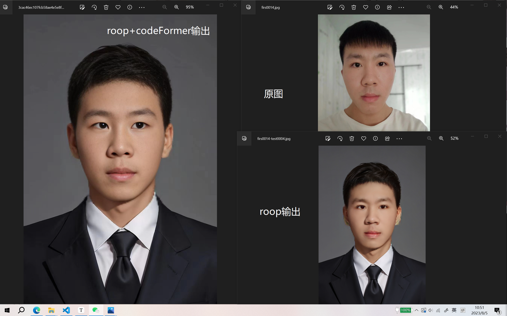

<div align="center">
 
</div>


<h1 align="center">Another_Me</h1>
<h1 align="center">基于roop与codeFormer的换脸输出</h1>

<p align="center">
    
    
    
    
</p>
<p align="center">
    
    
    
</p>

## 简介

基于roop的换脸算法，由于输入的像素值大小在卷积时默认为128 * 128，所以输出的图片作为正常图片使用时会有严重的割裂感
这时候我们采用codeFormer进行人脸增强，使其输出的图片正常化



## 环境

建议采用anaconda创建虚拟环境后再配置

运行`pip install -r requirements.txt`安装所需的包

若网络连接有问题，可以自行下载
```
numpy==1.23.5
opencv-python==4.8.0.74
onnx==1.14.0
insightface==0.7.3
psutil==5.9.5
tk==0.1.0
customtkinter==5.2.0
tkinterdnd2==0.3.0
torch==2.0.1
torchvision==0.15.2
onnxruntime==1.15.0
tensorflow==2.13.0
opennsfw2==0.10.2
protobuf==4.23.4
tqdm==4.65.0
addict
future
lmdb
Pillow
pyyaml
requests
scikit-image
scipy
tb-nightly
tqdm
yapf
lpips
ffmpeg
gdown # supports downloading the large file from Google Drive
```


## 报错提示

这里比较难安装的是ffmpeg，使用

`pip install ffmpeg`

或者使用codna安装

`conda install ffmpeg`

若还是报错'ffmpeg' not found

```
conda config --add channels conda-forge
conda install ffmpeg
pip install ffmpy

```

## 运行

使用python run.py运行全部，输出结果在results文件夹内

使用前记得查看run,py内的输入路径，

newface为输出的脸，

oldface则是将目标脸换到其他脸的底模，

savepath是作为roop的输出中转


## 使用docker

可用docker拉取我已经做好的镜像

```
docker pull relucy/anotherme:latest
```
